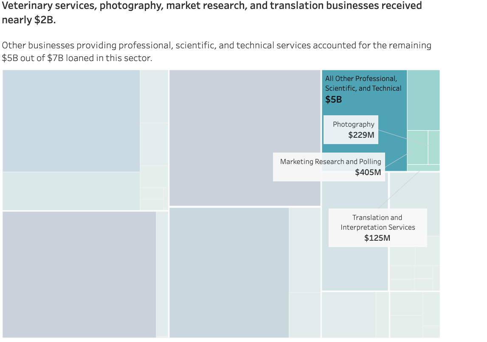

# Analysis of loan data from the Paycheck Protection Program 

This repository contains analysis scripts and visualizations based on loan
data from the Paycheck Protection Program, a U.S. federal relief scheme
for businesses in the wake of the coronavirus pandemic.

See [Technical notes](#Technical-notes) for software and methods used.

> **Warning:** This analysis is intended for demonstration and data exploration
purposes only.

### The Paycheck Protection Program for coronavirus relief

The [Paycheck Protection Program (PPP)] provides federal economic relief for the
coronavirus pandemic to businesses and non-profits. The program, overseen by the
U.S. Small Business Administration, is authorized to fund hundreds of
billions of dollars in loans, portions of which may be forgiven if spent on
eligible expenses such as payroll. The PPP has been scrutinized over issues such
as [excluding bankrupt borrowers] and [loans to nonexistent businesses].

In 2021, data from the program were released after a successful Freedom of
Information Act lawsuit. ProPublica maintains [a searchable database] of
more than 11 million loan records. The [latest datasets] are available from
the Small Business Administration website.

### Which economic sectors benefitted most from the program?

Over 11 million loans were approved in the PPP, according to the released data.
Only around 2% of loans went to nonprofits including nonprofit organizations,
nonprofit child care centers, and 501(c)s.

Industries known to be highly affected by the pandemic, such as healthcare,
construction, and hospitality were among the program's most well-represented
borrowers. Professional and "other" services were approved for the most loans of
any economic sectors.

 

<noscript></noscript>

 

<noscript></noscript>

 

<noscript></noscript>

### What type of professional services establishments received loans?

The number of loan dollars received was similar for the professional services
sector as for either healthcare or construction. Yet professional services are
not well-defined.

 

 

As a consultant working in data analysis services, I am interested in exploring loans to
businesses in my industry. In the first level of industry classification
provided, we still see two broad sectors that could be related to this kind of
work.

 

 

 

### Technical notes

This analysis was performed in R (see
[`ppp-foia-analysis.R`](./ppp-foia-analysis.R)) using PPP loan data from the
[U.S. Small Business Administration] and [industry classification labels from
the Census Bureau].

Industry labels from 2022 were used. Linkage was checked to ensure that records
without industry labels did not have valid industry information provided.

Visualizations were prepared using Datawrapper and Tableau.

[U.S. Small Business Administration]: https://data.sba.gov/dataset/ppp-foia
[ProPublica has developed a searchable database]: https://projects.propublica.org/coronavirus/bailouts/
[a searchable database]: https://projects.propublica.org/coronavirus/bailouts/
[latest datasets]: https://data.sba.gov/dataset/ppp-foia
[Paycheck Protection Program (PPP)]: https://home.treasury.gov/policy-issues/coronavirus/assistance-for-small-businesses/paycheck-protection-program
[excluding bankrupt borrowers]: https://www.propublica.org/article/ppp-loans-bankruptcy
[loans to nonexistent businesses]: https://www.propublica.org/article/ppp-farms
[industry classification labels from the Census Bureau]: https://www.census.gov/naics/?58967?yearbck=2022
